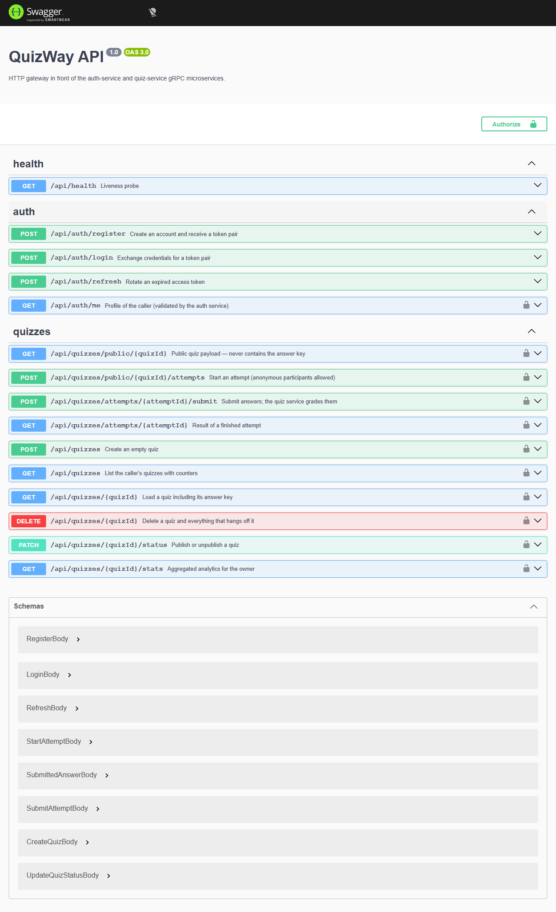

# QuizWay — API

The **backend twin** of the QuizWay web app: the same domain (users, quizzes,
attempts, grading) implemented as NestJS microservices that talk over gRPC.

It is a standalone project — no code is shared with the Next.js app. The point
is to demonstrate service-oriented design: a thin HTTP gateway, isolated domain
services, a shared data package and a background worker.

## Architecture

```
                    ┌────────────────────────────┐
   HTTP clients ───▶│  gateway  (REST + Swagger) │
                    └───────┬──────────────┬─────┘
                            │ gRPC         │ gRPC
                  ┌─────────▼──────┐  ┌────▼──────────────┐
                  │ auth-service   │  │ quiz-service      │
                  │ :50051         │  │ :50052            │
                  └─────────┬──────┘  └────┬──────────────┘
                            │              │ jobs (optional)
                            │              ▼
                            │        ┌───────────┐
                            │        │  worker   │  QUEUE_DRIVER=redis
                            │        └─────┬─────┘
                            ▼              ▼
                     ┌──────────────────────────┐   ┌───────┐
                     │ SQLite file (no server)  │   │ Redis │
                     └──────────────────────────┘   └───────┘
                  shared: @quizway/contracts · @quizway/prisma
```

| Service | Responsibility | Transport |
|---------|----------------|-----------|
| `gateway` | Auth, validation, Swagger, error translation | HTTP |
| `auth-service` | Accounts, bcrypt hashing, JWT issuing/validation | gRPC |
| `quiz-service` | Quizzes, attempts, grading, analytics, job publishing | gRPC |
| `worker` | Consumes `attempt.graded` jobs (audit trail, extensible) | BullMQ |

### Why this split

- **One writer per concern.** Only `auth-service` knows password hashes and
  signing keys; only `quiz-service` owns quiz state. The gateway holds neither.
- **Contracts first.** Both sides generate their gRPC options from the same
  `*.proto` files in `@quizway/contracts`, so the wire format cannot drift.
- **Slow work is asynchronous.** Grading returns immediately; anything
  non-essential (audit trail, future notifications) is pushed onto a queue.
- **Errors are translated once.** Nest's default gRPC filter turns every
  non-`RpcException` into `UNKNOWN: Internal server error` without logging it.
  `@quizway/nest-common` maps HTTP-style exceptions onto real gRPC status codes
  and logs the cause; the gateway maps them back to 400/401/404/409.

## Storage & background jobs

**Database — SQLite, zero setup.** `DATABASE_URL` points at a file
(`data/quizway.db`), so there is no server to install and nothing to run in the
background. All four services share the same file. The schema avoids
Postgres-only features (no native enums, no scalar lists), which keeps a later
move to Postgres a provider swap plus a migration.

**Queue — optional.** `QUEUE_DRIVER` decides where graded-attempt events go:

| Driver | Behaviour | Infrastructure |
|--------|-----------|----------------|
| `memory` (default) | The event is logged in-process; the response path is still non-blocking | none |
| `redis` | Events go to BullMQ and are consumed by `apps/worker` (audit trail, extension point for notifications) | Redis |

The domain service only depends on the `AttemptPublisher` port, so swapping the
driver never touches business logic.

## Repository layout

```
packages/
├── contracts/            # proto files, TypeScript types, shared env loader
│   ├── protos/*.proto
│   └── src/{auth,quiz,env,protos}.ts
├── nest-common/          # cross-service NestJS building blocks
│   └── src/grpc-exception.filter.ts
└── prisma/               # the single schema + PrismaService for every service
    ├── prisma/schema.prisma
    └── src/{prisma.module,prisma.service,seed}.ts
apps/
├── gateway/              # HTTP → gRPC, JWT guard, Swagger, error mapping
├── auth-service/         # gRPC AuthService
├── quiz-service/         # gRPC QuizService + attempt publisher
└── worker/               # BullMQ consumer (optional profile)
scripts/
└── smoke.mjs             # end-to-end check against a running stack
```

## Getting started (Docker)

```bash
cp .env.example .env
docker compose up --build
```

- REST API → <http://localhost:4000/api>
- Swagger → <http://localhost:4000/api/docs>
- Optional Kong proxy → `docker compose --profile kong up` (port `8000`)
- Optional Redis + worker → `docker compose --profile worker up`

The `migrate` service creates the SQLite schema and seeds the demo quiz before
any other service starts; the database lives on the `sqlite-data` volume.

Demo credentials: `demo@quizway.dev` / `Password123!`

## Getting started (local processes)

```bash
npm install
npm run prisma:generate
cp .env.example .env
npm run prisma:push        # creates data/quizway.db
npm run prisma:seed

npm run dev:auth           # terminal 1
npm run dev:quiz           # terminal 2
npm run dev:gateway        # terminal 3
npm run dev:worker         # terminal 4 — only with QUEUE_DRIVER=redis
```

Each `dev:*` script builds the shared packages first, so `ts-node` always sees
fresh contracts.

## API surface

| Method | Route | Auth | Description |
|--------|-------|------|-------------|
| `POST` | `/api/auth/register` | public | Create an account |
| `POST` | `/api/auth/login` | public | Exchange credentials for tokens |
| `POST` | `/api/auth/refresh` | public | Rotate the token pair |
| `GET` | `/api/auth/me` | bearer | Current profile |
| `GET` | `/api/quizzes` | bearer | List own quizzes |
| `POST` | `/api/quizzes` | bearer | Create a quiz |
| `GET` | `/api/quizzes/:id` | bearer | Quiz + answer key |
| `PATCH` | `/api/quizzes/:id/status` | bearer | Publish / unpublish |
| `DELETE` | `/api/quizzes/:id` | bearer | Delete a quiz |
| `GET` | `/api/quizzes/:id/stats` | bearer | Analytics |
| `GET` | `/api/quizzes/public/:id` | public | Quiz without the answer key |
| `POST` | `/api/quizzes/public/:id/attempts` | public | Start an attempt |
| `POST` | `/api/quizzes/attempts/:id/submit` | public | Submit (graded server-side) |
| `GET` | `/api/quizzes/attempts/:id` | public | Stored result |

Grading rules (identical to the web app): single-choice/true-false need the one
correct option, multiple-choice needs an exact set match, short text is compared
case- and whitespace-insensitively against the accepted answers.

## Quality gates

| Command | What it does |
|---------|--------------|
| `npm run typecheck` | `tsc --noEmit` in every workspace |
| `npm run test` | Jest unit tests (auth service, grading rules) |
| `npm run build` | Compiles packages, then all four apps |
| `npm run smoke` | End-to-end check against a running stack: login → quiz → attempt → grade → analytics, plus negative checks (answer key never leaks, wrong password and missing token are rejected) |

## Verification

| Check | Result |
|-------|--------|
| `npm run typecheck` | clean across all workspaces |
| `npm run test` | auth service + grading rules (10 tests) |
| `npm run build` | shared packages, then all four apps |
| `npm run smoke` | **12/12 pass** — health, login, refresh, list, load with answer key, start attempt, grade 6/6 (100%), pass flag, answer key hidden in the public payload, analytics, wrong password → 401, missing token → 401 |



*Swagger UI generated from the DTOs at `/api/docs`.*

CI runs install → `prisma generate` → package build → typecheck → tests → app
build on every push and pull request.

## Environment

See `.env.example`. Configuration is validated with Zod at process start, so a
missing `JWT_SECRET` or a malformed gRPC URL stops the boot with a readable
report instead of failing on the first request. Only two variables matter for a
local run: `DATABASE_URL` (SQLite file) and `JWT_SECRET`.

## License

Private — all rights reserved.
